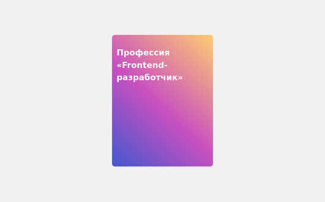

# 2D трансформации. Вращение

Часто, чтобы не перегружать внимание клиента дополнительной информацией, её прячут до того момента, пока она не понадобится. Один из таких приёмов — показ информации при наведении на элемент.

В этом задании вам нужно написать свойства для переворота карточки при наведении на неё. Итог задания выглядит так:

Переворот карточки — распространённый приём при вёрстке сайтов, который имеет несколько вариантов реализации. Ближе к концу курса вы научитесь использовать этот приём с помощью трёхмерного пространства, а пока реализуйте в двухмерном.

## Алгоритм переворота карточки

1. Изначально задняя сторона скрыта от пользователей поворотом стороны так, чтобы её не было видно. Обратите внимание на свойство `backface-visibility`, которое уже указано для двух сторон. Это свойство — ключ к пониманию. В этом варианте оно не показывает обратную сторону блока.
2. При наведении на главную обёртку карточки задняя сторона поворачивается к пользователю, а передняя скрывается. Обычно поворот происходит на то же значение, что и у задней стороны. Это помогает плавнее проиграть анимацию, а также использовать переменные.

## Подсказки

[backface-visibility](https://developer.mozilla.org/en-US/docs/Web/CSS/backface-visibility)