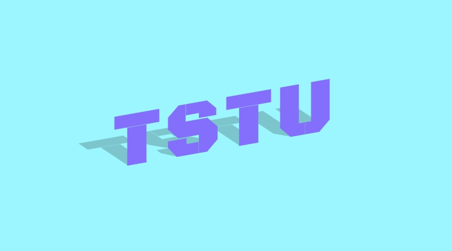

#  2D трансформации. Наклон

Cоздайте наклонный логотип ТГТУ и добавьте к нему тень. Необходимая вёрстка и базовые стили уже определены в соответствующих файлах. Вам необходимо создать компонент `Shadow Skew`.

Компонент состоит из двух составляющих:

1. Класса `.shadow-skew`. Он применяется к текстовому элементу, на который необходимо наложить тень.
2. Псевдоэлемента `::before`. Нужен для создания и позиционирования тени элемента.

## Класс shadow-skew

Класс выполняет две функции:

1. Переводит все символы в верхний регистр.
2. Наклоняет строку на минус 10 градусов по оси *y*.

## Псевдоэлемент

Здесь происходит вся «магия». Псевдоэлемент имеет следующие характеристики:

- В качестве контента для псевдоэлемента используется значение из атрибута `data-content`.
- Цвет тени: `#0003`.
- Элемент имеет множественные трансформации:
    1. Наклон на 50 градусов по оси *x*.
    2. Перемещение на -0.35em по оси *x* и 0.12em по оси *y*.
    3. Масштабирование по оси *y* со значением 0.6.

Используя эти особенности, напишите необходимые стили. Решения могут быть соверешенно разными. В конечном итоге не забудьте проанализировать полученные решения для составления полной картины возможных реализаций.

## Подсказки

- Для получения значения из атрибута `data-content` используйте функцию [attr()](https://developer.mozilla.org/ru/docs/Web/CSS/attr), доступную у свойства `content`.
- Для решения вам может помочь умение использовать связку относительного и абсолютного позиционирования.